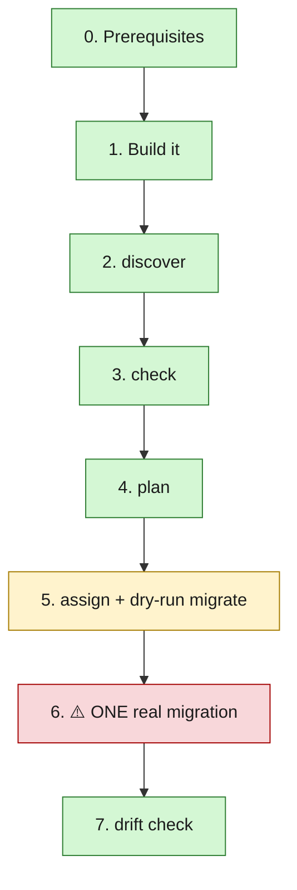

<div align="center">

# 🧪 Testing checklist

🟢 read-only → 🟢 read-only → 🟢 read-only → 🟡 no API calls → 🔴 the real thing → 🟢 verify

**You're the first person to run this against a real cluster.** Everything
below has only been tested against mocks so far.

</div>

The steps are ordered so the one genuinely risky step — an actual migration
— comes **last**. You can stop after any step and still have given useful
feedback; you don't need to reach step 6 for this to be worthwhile.



---

## 0️⃣ Before you start 🟢 *safe*

- [ ] Point this at **non-production VMs only** — a couple of throwaway
      test VMs on the ESXi side is ideal.
- [ ] Install and independently verify Steampipe + both plugins. Full
      instructions with real install commands and links to each plugin's
      own docs are in the README's
      ["Installing Steampipe and the plugins"](README.md#-installing-steampipe-and-the-plugins)
      section; the short version:

  ```bash
  # 1. Steampipe itself (Linux/WSL2; see the README for macOS)
  sudo /bin/sh -c "$(curl -fsSL https://steampipe.io/install/steampipe.sh)"

  # 2. Both plugins
  steampipe plugin install theapsgroup/vsphere
  steampipe plugin install becash143/proxmox

  # 3. Configure each connection (~/.steampipe/config/*.spc) --
  #    see the README section above for the vsphere connection block;
  #    for proxmox, check the plugin's own docs/README linked there,
  #    since we couldn't independently verify its exact connection
  #    field names.

  # 4. Confirm BOTH work before going anywhere near vmmigrate
  steampipe query "select * from vsphere_vm limit 1"
  steampipe query "select * from proxmox_vm limit 1"
  ```

  > 🛑 If step 4 doesn't return real rows for both, **stop here** — that's
  > a Steampipe/plugin problem, not a `vmmigrate` problem, and step 2 below
  > will just fail with the same root cause one layer removed.

- [ ] Have a **Proxmox API token** ready (`Datacenter > Permissions > API
      Tokens`) with rights to create VMs on the target node.

## 1️⃣ Build it 🟢 *safe*

```bash
go build -o vmmigrate ./cmd/vmmigrate
```

📮 **If this fails, that's the first useful bug report** — send the error.

> 📌 Run every command below **from the repo root**, in the same directory
> each time. `discover` looks for `queries/discover_*.sql` relative to
> your current directory (not the binary's location), and all commands
> share `vmmigrate-state.json` the same way — if you move the binary
> elsewhere or `cd` around between steps, you'll get a confusing "no such
> file" error that has nothing to do with Steampipe or Proxmox. If you'd
> rather not stay in one directory, pass `--vsphere-sql` / `--proxmox-sql`
> / `--state` explicitly instead.

## 2️⃣ Discover 🟢 *read-only, safe*

```bash
./vmmigrate discover
```

⚡ **This might still fail on the first try** if your `proxmox_vm` table
doesn't match the becash143/proxmox plugin schema this repo now targets
(`vm_id, name, node, status, cpus, max_mem`) — e.g. if you're on an
older/different version of the plugin. If so, edit
`queries/discover_proxmox.sql` and `internal/model/vm.go` to match what
`steampipe query "select * from proxmox_vm"` actually returns for you,
then re-run.

📮 **What to send back:** the exact error if it fails, or the success line
(`Discovered N vSphere VM(s) and M Proxmox VM(s)...`) if it works.

## 3️⃣ Check 🟢 *read-only, safe*

```bash
./vmmigrate check
```

📮 **What to send back:** the full output. Do the alarms make sense for
your actual VMs (e.g. does it correctly flag a powered-on VM, a Windows
VM, etc.), or does anything look wrong/missing?

## 4️⃣ Plan 🟢 *read-only, safe*

```bash
./vmmigrate plan
```

Everything will probably land in "ungrouped" unless you've tagged VMs with
a custom attribute — that's expected for now, see the README.

## 5️⃣ Assign + dry-run migrate 🟡 *still safe — no API calls*

```bash
./vmmigrate assign \
  --wave test \
  --vm <a moref from your discover output> \
  --node <your pve node> \
  --vmid <a free vmid> \
  --esxi-storage <the storage ID you registered for ESXi> \
  --esxi-path "ha-datacenter/<vm folder>/<vm>.vmdk"

./vmmigrate migrate --wave test --dry-run
```

📮 **What to send back:** does the dry-run output look right for your
environment?

## 6️⃣ The real test: one actual migration 🔴 *risky — do this once, deliberately*

> ⚠️ Only do this once steps 1–5 look right, and **only** against a VM
> you're fully OK with re-creating if something goes wrong.

```bash
export PVE_URL=https://your-pve-host:8006
export PVE_TOKEN_ID="root@pam!vm-migrate"
export PVE_TOKEN_VALUE="your-token-secret"

./vmmigrate migrate --wave test --concurrency 1
```

📮 **What to send back, whether it works or not:**
- The full console output
- If it fails: which step failed (VM creation? task polling? something
  else), and the exact error text
- If it succeeds: does the resulting Proxmox VM look right? Right
  CPU/memory, boots correctly, disk attached?

## 7️⃣ Drift check 🟢 *read-only, safe — run after the VM boots*

```bash
./vmmigrate drift --wave test
```

📮 **What to send back:** any drift findings it reports, and whether they
match reality (e.g. if it flags a firmware mismatch, was there actually
one?).

---

<div align="center">

**Anything that breaks is useful.** The whole point of you testing this is
to find the gap between "works against my mocks" and "works against a
real cluster."

</div>
